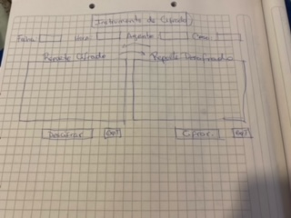
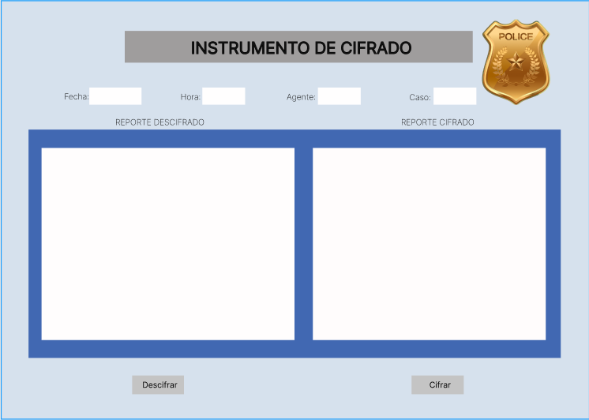
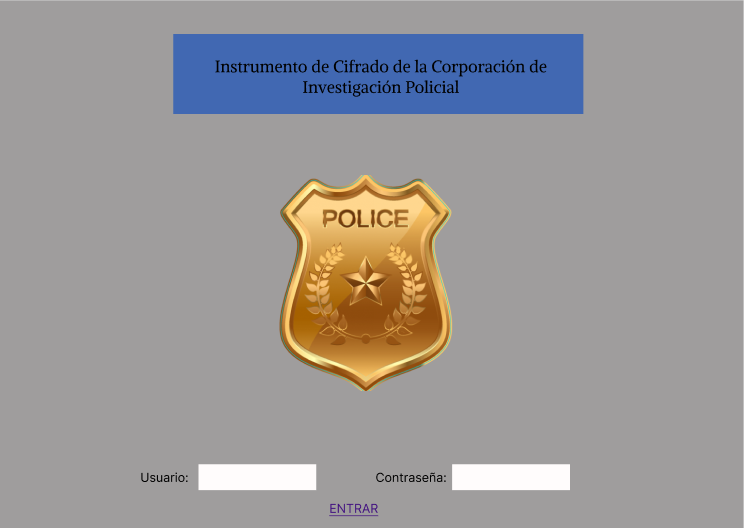

# Cifrado César

### Definición del producto

Ideé un instrumento de cifrado para agentes policiales. El propósito es evitar la fuga de información que pueda entorpecer el proceso investigativo de dichas entidades. En principio me enfoqué en cómo debería verse la interfáz, escogí colores sobrios y comunmente utilizados en las instituciones de seguridad como lo son el azul, gris, negro y beige.

En las siguientes imagenes muestro lo que fue mi prototipo de baja fidelidad:

A continuación, mi prototipo de alta fidelidad:

* Quiénes son los principales usuarios de producto.

Desarollé un producto pensado para agentes policiales de investigación de las diferentes divisiones, antinarcóticos, anticorrupción, etc.
* Cuáles son los objetivos de estos usuarios en relación con tu producto.

Los usuarios contarán con un instrumento de cifrado que les permitirá encriptar el contenido concerniente a reportes, interrogatorios y nuevos datos de las diversas investigaciones que lleven a cabo, con la finalidad de evitar "fuga de informaciones" que pongan en riesgo la integridad de las pesquisas.
* Cómo crees que el producto que estás creando está resolviendo sus problemas.

El instrumento permite la seguridad de las informaciones y es de muy fácil uso. Para poder decodificar el contenido es necesario conocer el Offset que el agente colocó al momento de hacer el cifrado, por lo que impedirá que terceras personas puedan acceder a los datos allí ingresados.